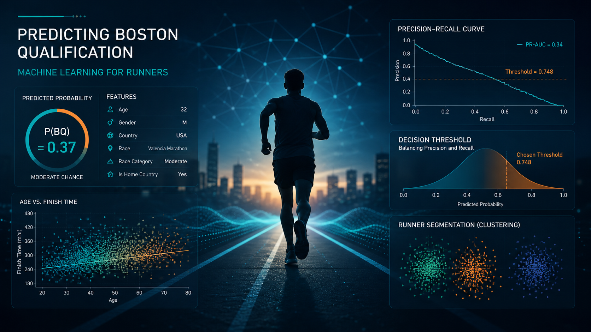

  

# Boston Marathon BQ Predictor

**Machine Learning Capstone Project** · The Bridge Data Science & AI Bootcamp (Madrid, 2026)  
**Author:** Gian Marco Assandria  

---

## Problem Statement

Will a runner achieve the Boston Qualifier (BQ) time standard in a marathon?

This project builds a **binary classification model** that estimates the probability that a runner will achieve the **official BQ time standard** based on demographic and race-related information.

The model does not evaluate actual finishing times directly; instead, it learns historical patterns of similar runners across thousands of marathon events.

### Example use case

A 32-year-old runner planning to participate in the Valencia Marathon wants to estimate, before training, their probability of qualifying for Boston based on historical runners with similar profiles in that race.

---

## Dataset

Source: [Boston Marathon Qualifiers Dataset](https://www.kaggle.com/datasets/runningwithrock/boston-marathon-qualifiers-dataset) (Kaggle, Running with Rock, 2025)

### Raw data

- **1.76M race results**
- **759 Race × Year combinations** after cleaning
- **3 years of data:** 2022, 2023, 2024
- **3 relational tables:**
  - Results
  - Races
  - BQStandards

---

### Final dataset (after cleaning & sampling)

| Split | Size | Years | Description |
|------|------|------|-------------|
| Train | 225,356 | 2022–2023 | Used for model training and cross-validation |
| Test | 74,644 | 2024 | Held-out set for final evaluation |

- **Base BQ rate (train):** 13.45%  
- **Base BQ rate (test):** 14.30%  

👉 This confirms **temporal distribution drift**, meaning runner performance distributions changed slightly over time.

---

## Project Overview

The project is structured into multiple stages:

### 01 — Data Cleaning & Target Definition
- Removal of DNFs and invalid records
- Filtering of unrealistic ages and finish times
- Construction of target:

---

### 02 — Exploratory Data Analysis (EDA)
Key findings:
- Age has a strong non-linear effect on BQ probability
- Race difficulty strongly influences qualification rates
- Country introduces cultural and training-system bias
- Strong imbalance in the dataset (~87% non-BQ / 13% BQ)

---

### 03 — Feature Engineering
- Removal of leakage features:
- Finish time
- BQ standards
- Rankings
- K-Fold Target Encoding for Race
- Country grouping (rare countries → “OTHER”)
- Derived features:
- Age² (non-linearity)
- Race category encoding
- Home country indicator

---

### 04 — Baseline Models
Models evaluated:
- Dummy classifiers
- Logistic Regression
- Decision Trees

Findings:
- Low F1 (~0.16–0.17)
- Good ROC-AUC (~0.73)

👉 Models were capable of ranking but failed at classification due to threshold miscalibration.

---

### 05 — Advanced Models
Models tested:
- Random Forest
- XGBoost

Key result:
- Slight improvements in ranking
- No significant F1 improvement

👉 Conclusion: model capacity was NOT the bottleneck.

---

### 06 — Class Imbalance Handling
Methods tested:
- No balancing
- `scale_pos_weight` (XGBoost)
- SMOTE

Final choice:
- **XGBoost + scale_pos_weight**

Reason:
- Same PR-AUC as SMOTE
- Faster training
- No synthetic data artifacts
- Better interpretability

---

### 07 — Threshold Optimization
Instead of default threshold (0.5), probabilities were calibrated using:

- F1 (balanced)
- F2 (recall-focused)
- **F0.5 (precision-focused)**

### Final decision:
The main performance gain came from threshold tuning, not model improvement.

---

### 08 — Unsupervised Learning (Clustering)
KMeans clustering using:
- Age
- Finish time

### Result: 4 runner archetypes

| Cluster | Description |
|--------|-------------|
| Advanced Young | Fast, young runners |
| Advanced Veteran | Fast, experienced runners |
| Aspiring Young | Slower developing runners |
| Aspiring Veteran | Recreational older runners |

👉 Insight: Age is as important as performance in defining runner archetypes.

---

## Final Model

### Architecture

The final system combines three components:

1. **XGBoost model** → probability estimation
2. **Threshold tuning (0.748)** → decision calibration
3. **KMeans clustering** → contextual interpretation

---

### Final performance (Test 2024)

| Metric | Value |
|------|------|
| F1 | 0.330 |
| Precision | 0.372 |
| Recall | 0.296 |
| PR-AUC | 0.302 |
| ROC-AUC | 0.741 |

---

## Key Insights

- Model capacity was sufficient from the beginning
- The main improvement came from **decision threshold optimization**
- Data is strongly affected by:
  - Age-dependent qualification rules
  - Country bias (US-dominant dataset)
  - Temporal drift (faster modern runners)
- Clustering adds interpretability, not predictive power

---

## ⚠️ Limitations

- Strong US-centric dataset bias
- No physiological training variables (VO2 max, training volume, etc.)
- Binary gender constraint (M/F only due to standards)
- Temporal drift not explicitly modeled

---

## Business Value

This system can be used as:

- A **probabilistic coaching tool**
- A **race planning assistant**
- A **performance benchmarking system**

It answers:

- “What is my probability of qualifying for Boston?”
- “What type of runner am I similar to?”
- “What should I improve to change category?”
